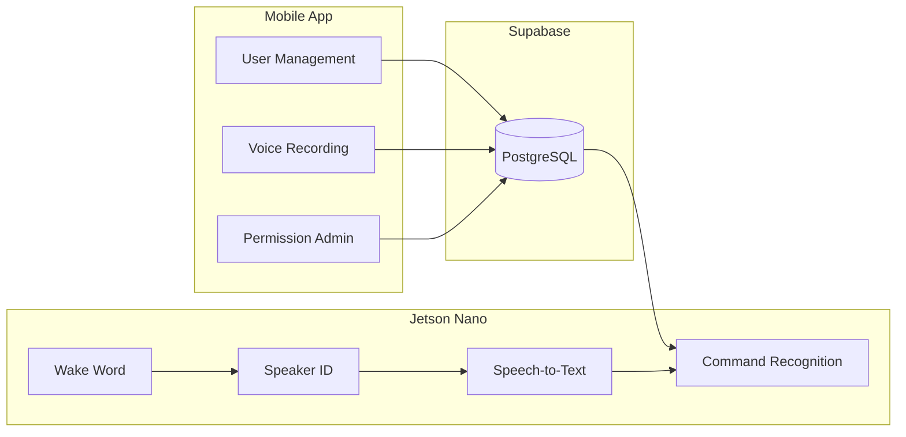

# Voice Control App

A Final Year Project (FYP) smart home system that combines a React Native mobile app with an edge AI pipeline on NVIDIA Jetson Nano. Users manage household members and device permissions from the app, while the Jetson device listens for wake words, identifies speakers, transcribes commands, and enforces access control — all backed by a shared Supabase database.

## System Overview



| Component | Role |
|-----------|------|
| **Mobile app** | Register users, set passwords, record voice commands, manage fan/light/door permissions |
| **Supabase** | Central database for users, permissions, and voice recording metadata |
| **Jetson Nano** | On-device wake word detection, speaker verification, STT, and intent matching with permission checks |

## Features

### Mobile App
- **Voice recording** — Capture and upload voice commands to Supabase
- **User management** — Register, edit, and browse family members
- **Role-based access** — Admin, parent, and child roles with different privileges
- **Device permissions** — Per-user control over fan, light, and door access
- **Password login** — 6-character password per user, stored locally after login
- **Parent-only admin** — Only parents can modify other users' permissions

### Jetson Nano Edge Device
- **Wake word detection** — Picovoice Porcupine triggers the voice pipeline
- **Speaker identification** — SpeechBrain ECAPA embeddings match against enrolled voice samples
- **Speech-to-text** — Local Whisper model transcribes spoken commands
- **Intent recognition** — Sentence-transformer embeddings map text to device actions (fan/light/door on/off/open/close)
- **Permission enforcement** — Syncs user permissions from Supabase before executing commands
- **Desktop GUI** — Tkinter interface for monitoring status and syncing permissions

## Tech Stack

| Layer | Technology |
|-------|------------|
| Mobile framework | React Native 0.81 + Expo SDK 54 |
| Navigation | React Navigation 7 (Bottom Tabs + Stack) |
| Backend | Supabase (PostgreSQL + REST API) |
| Mobile audio | Expo AV |
| Mobile state | React Context API + AsyncStorage |
| Mobile storage | expo-file-system |
| UI icons | react-native-vector-icons |
| Utilities | react-native-safe-area-context, react-native-gesture-handler, react-native-url-polyfill |
| Edge runtime | Python 3 on NVIDIA Jetson Nano |
| Wake word | Picovoice Porcupine |
| Speaker ID | SpeechBrain (ECAPA-VoxCeleb) |
| STT | OpenAI Whisper (local) |
| Intent matching | Sentence Transformers (all-MiniLM-L6-v2) |
| Edge GUI | Tkinter |

## Project Structure

```
├── App.js                              # Entry point — tab + stack navigators
├── app.json                            # Expo config (Supabase credentials)
├── babel.config.js                     # Babel preset (babel-preset-expo)
├── eas.json                            # EAS Build profiles
├── .gitignore
├── assets/                             # Icons, splash screen, favicon
├── src/
│   ├── context/
│   │   └── UserContext.js              # Auth state, permissions, login/logout
│   ├── lib/
│   │   └── supabase.js                 # Supabase client
│   ├── screens/
│   │   ├── HomeScreen.js               # Landing page with record button
│   │   ├── VoiceRecordingScreen.js     # Audio recording + upload
│   │   ├── UserListScreen.js           # Browse all users
│   │   ├── UserDetailScreen.js         # Profile, password login
│   │   ├── RegisterUserScreen.js       # Create a new user
│   │   ├── EditUserScreen.js           # Edit user details
│   │   ├── ManagePermissionsScreen.js  # Toggle permissions (parent only)
│   │   └── SettingsScreen.js           # Profile info + logout
│   └── services/
│       ├── userService.js              # User CRUD, password set/verify
│       ├── permissionService.js        # Permission queries + toggle
│       └── recordingService.js         # Voice recording upload
├── Jetson Nano/
│   ├── gui.py                          # Main Tkinter GUI + pipeline orchestration
│   ├── wake.py                         # Wake word detection (Porcupine)
│   ├── speaker_id.py                   # Speaker identification (SpeechBrain)
│   ├── stt.py                          # Speech-to-text (Whisper)
│   ├── command_recognizer.py           # Intent matching via embeddings
│   ├── supabase_client.py              # Fetch user permissions from Supabase
│   └── config.py                       # Audio settings, model paths, API keys
└── .github/workflows/
    └── build-android.yml               # CI workflow to build Android APK
```

## Database Schema

Hosted on **Supabase** (PostgreSQL).

### users
| Column | Type | Notes |
|--------|------|-------|
| id | uuid (PK) | Auto-generated |
| name | varchar | Required |
| email | varchar | Unique |
| role | varchar | `admin`, `parent`, or `child` |
| password | varchar(6) | Nullable — set on first login |
| status | varchar | `active` or `inactive` |

### permissions
Three fixed rows: **fan**, **light**, **door**

### user_permissions
Maps each user to each permission with a `granted` boolean. If no row exists, access defaults to granted.

### voice_recordings
Stores recording metadata, base64-encoded audio (`audio_base64`), transcription, command type, and processing status (`uploaded` → `processing` → `processed` / `failed`).

A server-side PostgreSQL function `toggle_user_permission()` enforces that only parent users can modify permissions.

## Getting Started

### Prerequisites

**Mobile app**
- Node.js 18+
- Expo Go on your phone, or an Android/iOS emulator

**Jetson Nano**
- NVIDIA Jetson Nano with JetPack installed
- USB microphone
- Python 3.8+
- Picovoice access key ([picovoice.ai](https://picovoice.ai))

### Configuration

1. Create a Supabase project and set up the tables described above.
2. Add your Supabase URL, anon key, and recordings bucket to `app.json`:

```json
"extra": {
  "supabaseUrl": "https://your-project.supabase.co",
  "supabaseAnonKey": "your-anon-key",
  "recordingsBucket": "recordings"
}
```

> **Security tip:** Consider using `expo-constants` with `.env` variables instead of hardcoding credentials in `app.json`, especially if your repository is public.

3. Update `Jetson Nano/supabase_client.py` with the same Supabase credentials.
4. Set your Picovoice access key in `Jetson Nano/config.py`:

```python
ACCESS_KEY = "YOUR_PICOVOICE_ACCESS_KEY"
```

### Run the Mobile App

```bash
npm install
npm start
```

Scan the QR code with Expo Go, or press `a` (Android) / `i` (iOS) to open in an emulator.

### Run the Jetson Nano Pipeline

Install Python dependencies (PyTorch, SpeechBrain, Transformers, Picovoice, Supabase client, etc.), place model files under `Jetson Nano/models/`, and add speaker enrollment samples to `Jetson Nano/voice_samples/` (named `{speaker}_{sample}.wav`).

```bash
cd "Jetson Nano"
python gui.py
```

Use the **Sync Permissions** button in the GUI to pull the latest user permissions from Supabase.

### Build Android APK

**Via GitHub Actions** — trigger the `Build Android APK` workflow manually; the APK is uploaded as an artifact.

**Via EAS Build** (requires Expo account):

```bash
npx eas-cli build --platform android --profile preview
```

## App Flow

### Mobile App
1. **Register** a user from the Users tab (name, email, role).
2. **Select** a user from their detail page — first-time users create a 6-character password.
3. **Log in** by entering the password on subsequent visits.
4. **Record** voice commands from the Home screen; audio is uploaded to Supabase.
5. **Manage permissions** (parent only) — toggle fan/light/door access per user.
6. **View profile** and log out from the Settings tab.

### Jetson Nano
1. **Wake word** detected → pipeline starts recording.
2. **Speaker ID** matches the voice against enrolled samples.
3. **Whisper** transcribes the spoken command.
4. **Intent recognizer** maps the text to a device action (e.g. turn on light).
5. **Permission check** — command is allowed or denied based on synced Supabase permissions.
6. Result is displayed in the GUI.

## Supported Voice Commands

| Device | Actions | Example phrases |
|--------|---------|-----------------|
| Light | on, off | "turn on the light", "lights off" |
| Fan | on, off | "turn on the fan", "fan off" |
| Door | open, close | "open the door", "lock the door" |

Intent matching uses semantic similarity with a confidence threshold of 0.65.
